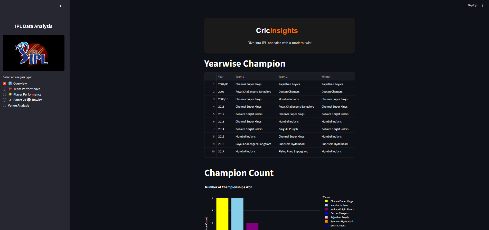
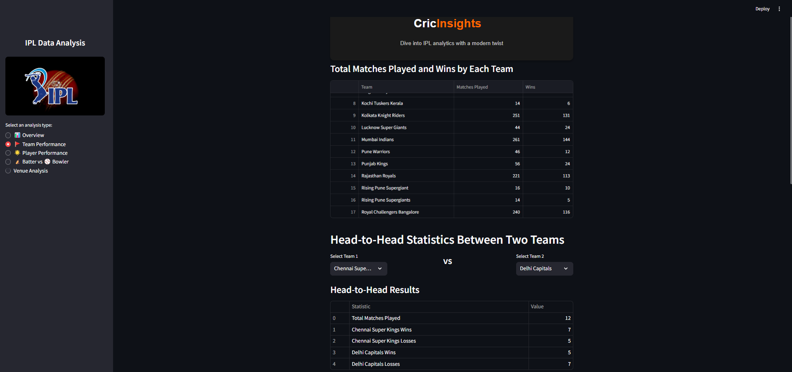
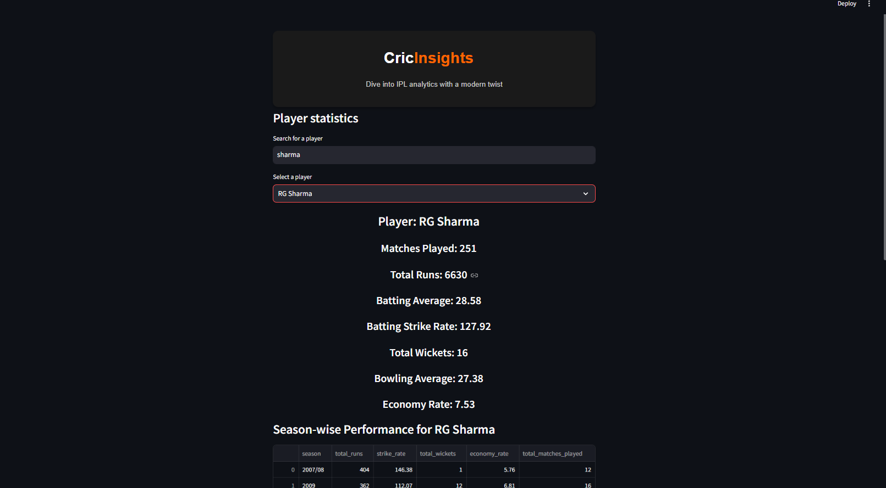
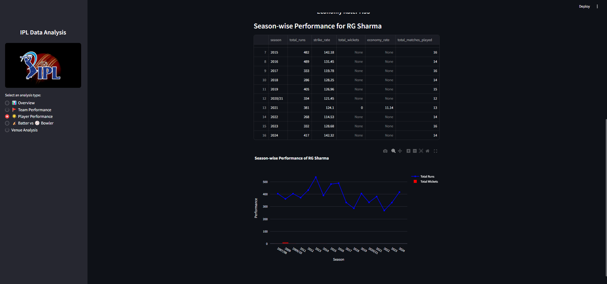
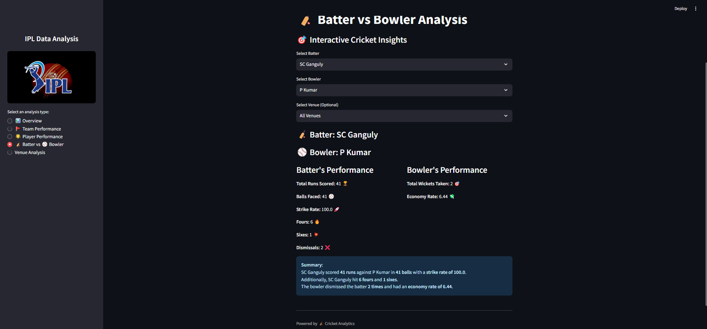
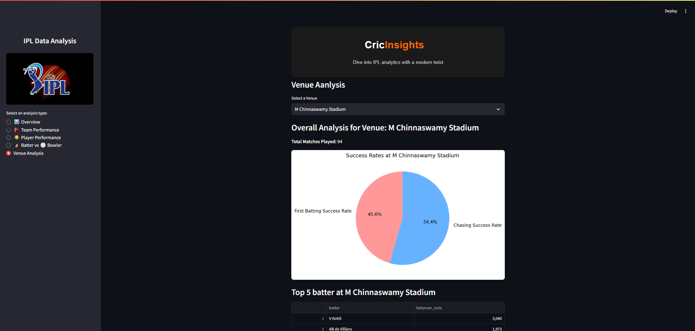

#### 🏏CricInsights IPL Data Analysis App
Welcome to the IPL Data Analysis App! This app is designed to provide insightful visualizations and analyses of IPL (Indian Premier League) data. Built using Streamlit, it allows users to explore key statistics, trends, and performance metrics for teams and players in the IPL.

#### 🌐 Website Link
Visit the app here:  https://cricinsights.streamlit.app/
#### 🚀 Features
- **📊 Interactive Dashboards:** Explore team and player performance using interactive charts and tables.
- **📅 Year-Wise Analysis:** Compare performances across different IPL seasons.
- **🏏 Player Statistics:** Analyze individual player stats such as runs, wickets, and strike rates.
- **📈 Team Performance:** View team-specific statistics and match outcomes.
- **🌟 Top Performers:** Highlight top players in batting, bowling, and all-rounder categories.
- **🔍 Search and Filter Options:** Quickly find specific information by searching or filtering data.

##### 🛠️ Technologies Used
- **Python:** The core programming language for data analysis.
- **Streamlit:** Framework for building the interactive web app.
- **Pandas:** Data manipulation and analysis library.
- **Matplotlib & Seaborn:** Visualization libraries for static and detailed plots.
- **Plotly:** Interactive visualization library for dynamic and engaging charts.
- **IPL Dataset**: Preprocessed CSV files containing historical IPL data.

#### ⚙️ Setup and Installation
Follow these steps to set up the app on your local machine:

##### 1.Clone the repository:
         git clone https://github.com/your-username/ipl-data-analysis-app.git
         cd ipl-data-analysis-app 
##### 2.Create a virtual environment:
         python -m venv env
         source env/bin/activate   # On Windows: .\env\Scripts\activate 
##### 3.Install dependencies:
         pip install -r requirements.txt

##### 4.Run the app:
         streamlit run app.py         

#### 🗂️ IPL Dataset
Ensure you have the following datasets in the data/ folder:

- matches.csv: Contains match-level information such as match ID, date, teams, and results.
- deliveries.csv: Contains ball-by-ball details of every IPL match.

#### 📊 Insights You Can Discover
- **Year-wise Champion:** View the IPL champion for each season.
- **Champion Count:** Analyze the number of titles won by each team.
- **Total Matches Played and Wins by Each Team:** Evaluate the overall performance of all teams.
- **Head-to-Head Statistics:** Compare performance metrics between two selected teams.
- **Season-Wise Performance of Teams:** Track the performance of all teams in a selected season.
- **Player Statistics:** Dive deep into individual player metrics such as runs, wickets, and strike rate.

#### 📷 Screenshots
Dashboard Overview

Team Analysi

 

#### 💡 Future Improvements
- Add advanced predictive analytics using machine learning.
- Include more interactive features like live match updates.

#### 📝 License
This project is licensed under the MIT License.